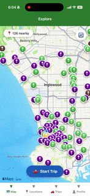
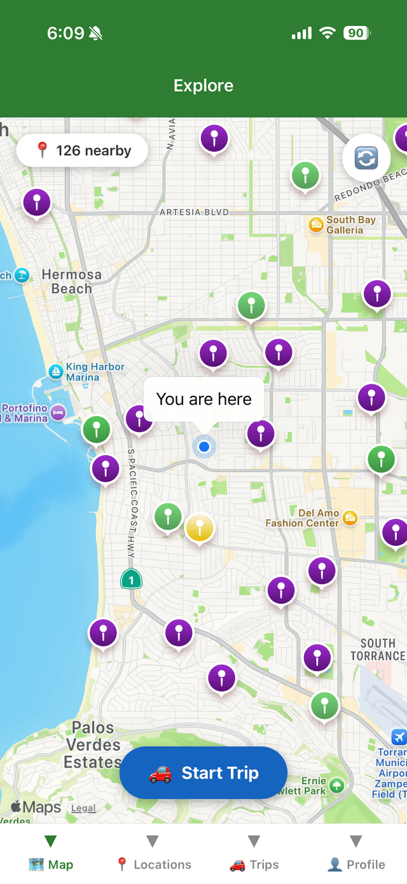
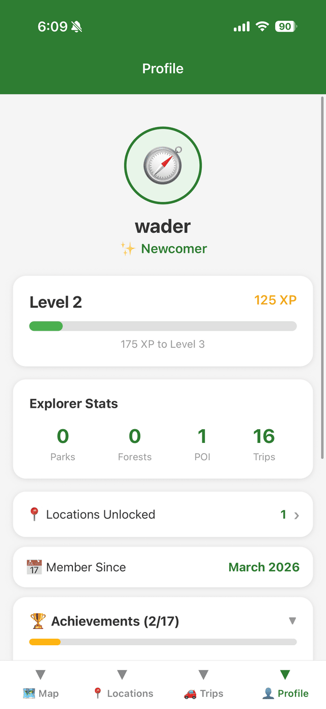

# Unlock the Road

**A gamified travel companion that turns real-world road trips into a location-unlocking game.** Travelers physically visit National Parks, forests, and points of interest, "unlock" them via GPS proximity, earn XP, and level up their explorer profile — all while the app records their trip route in the background.

Full-stack solo build: a **Flask + MongoDB** REST API and a **React Native (Expo)** mobile client, deployed to the cloud and distributed to physical iOS devices.

<!-- TODO: replace with your live demo GIF — 10s of approaching a location and unlocking it -->
<p align="center">
  
</p>

---

## Demo

<!-- TODO: drop 3–4 phone screenshots into a docs/ folder and update the paths below -->
<p align="center">
  
  
  
  
</p>

> *Live map with route tracking · Location detail & proximity unlock · XP / leveling profile · Per-location photo galleries*

---

## What it does

- **Unlock by being there.** The app uses GPS to detect when you're within range of a real-world location and lets you unlock it — geocaching meets a travel journal.
- **Level up.** Each unlock awards XP based on location type; users level up and earn customizable avatars and titles.
- **Record the journey.** Background location tracking captures your route as a breadcrumb trail, drawn live on the map and saved to trip history.
- **Capture the memory.** Users attach photos to locations, stored in the cloud and viewable as per-location galleries.
- **Explore real data.** Locations are seeded from the National Park Service and Google Places APIs.

---

## Architecture

```
┌─────────────────────────┐         ┌──────────────────────────┐
│   Mobile client          │  HTTPS  │   Flask REST API          │
│   React Native (Expo)    │ ──────► │   JWT auth · Blueprints   │
│                          │ ◄────── │                           │
│   • Map + live route     │  JSON   │   ┌────────────────────┐  │
│   • Background GPS task   │         │   │ MongoDB Atlas       │  │
│   • Secure token storage  │         │   │ 2dsphere geo index  │  │
└─────────────────────────┘         │   └────────────────────┘  │
                                     │   ┌────────────────────┐  │
                                     │   │ Cloudinary (photos) │  │
                                     │   └────────────────────┘  │
                                     └──────────────────────────┘
```

The phone talks to a Flask API over HTTPS. Flask handles auth, gamification logic, and geospatial proximity checks against MongoDB Atlas, while user-uploaded photos are offloaded to Cloudinary.

---

## Tech stack

**Backend**
- **Flask 3** — REST API organized with blueprints
- **MongoDB Atlas** — document store with a **2dsphere geospatial index** for proximity queries
- **Flask-JWT-Extended** — access/refresh token authentication
- **Flask-Bcrypt** — password hashing
- **Marshmallow** — input validation / serialization
- **Cloudinary** — cloud image storage
- **Gunicorn** — production WSGI server

**Mobile**
- **React Native 0.83 + Expo SDK 55** (React 19)
- **React Navigation** — native-stack + bottom-tabs
- **expo-location + expo-task-manager** — foreground and background GPS
- **react-native-maps** — map rendering with live route polyline
- **expo-secure-store** — encrypted token storage
- **expo-image-picker + expo-haptics** — photo capture and tactile unlock feedback
- **Axios** — API client

**Infrastructure / DevOps**
- **Render** — backend hosting with auto-deploy from GitHub
- **EAS Build** — cloud iOS builds, internal distribution via the Apple Developer Program

---

## Technical highlights

The parts of this build that required the most engineering judgment:

**Geospatial proximity unlocking.** Locations are stored as GeoJSON points with a MongoDB `2dsphere` index, so "is the user close enough to unlock this?" is a single indexed `$near` query rather than a full-collection distance scan — it stays fast as the location dataset grows into the thousands.

**Background location tracking on iOS.** Recording a trip route means tracking GPS even when the app is backgrounded, handled via `expo-task-manager`. The catch: `expo-secure-store` (where the auth token lives) isn't accessible from a background task on iOS. I worked around it by caching the JWT in memory when the background task starts, so the breadcrumb-uploading requests can still authenticate without touching secure storage from the background context.

**Persistent photo storage on an ephemeral host.** Render's container filesystem is ephemeral — anything written to local disk vanishes on redeploy, which meant uploaded photos disappeared. I migrated image storage to Cloudinary, so photo URLs persist independently of the backend's lifecycle.

**Token-based auth with refresh.** Short-lived access tokens plus long-lived refresh tokens keep sessions secure without forcing users to log in constantly, with the refresh flow handled transparently by the API client.

**Real iOS device distribution.** Because Expo SDK 55 isn't compatible with Expo Go, running on a physical iPhone required a custom dev client built through EAS, Apple Developer Program enrollment, and device UDID registration — closer to a real app-shipping pipeline than a typical Expo demo.

---

## API overview

JWT-authenticated REST API. Core endpoint groups:

| Group        | Examples                                                      |
|--------------|--------------------------------------------------------------|
| **Auth**     | `POST /api/auth/register` · `POST /api/auth/login` · `POST /api/auth/refresh` · `GET /api/auth/me` |
| **Users**    | `PATCH /api/users/profile` · `GET /api/users/<username>` · `GET /api/users/unlocks` |
| **Locations**| `GET /api/locations/` · `GET /api/locations/nearby` · `POST /api/locations/unlock` |
| **Trips**    | Create, list, and retrieve recorded road trips with route data |
| **Photos**   | Upload and retrieve per-location photos (Cloudinary-backed)   |

Example — unlock a location by proximity:

```bash
curl -X POST https://<your-api-host>/api/locations/unlock \
  -H "Content-Type: application/json" \
  -H "Authorization: Bearer <access_token>" \
  -d '{"location_id": "<id>", "latitude": 44.4605, "longitude": -110.8281}'
```

---

## Project structure

```
Unlock-the-Road/
├── backend/                  # Flask REST API
│   ├── app/
│   │   ├── __init__.py        # App factory, extensions, geo index setup
│   │   ├── models/            # user, location, trip, photo, achievement
│   │   ├── routes/            # auth, users, locations, trips, photos
│   │   └── utils/             # serializers, validators
│   ├── config/                # settings
│   ├── seed_nps.py            # Seed from National Park Service API
│   ├── seed_google_places.py  # Seed from Google Places API
│   ├── requirements.txt
│   ├── run.py                 # Entry point
│   └── .env.example
└── mobile/                   # React Native (Expo) client
    ├── src/
    │   ├── screens/           # Map, Locations, LocationDetail, Profile,
    │   │                      #   Trip history/detail, Login/Register
    │   ├── components/        # UnlockCelebration, etc.
    │   ├── context/           # AuthContext, UnitsContext
    │   ├── navigation/        # AppNavigator
    │   └── services/          # api.js, backgroundLocation.js
    ├── app.json
    └── package.json
```

---

## Running it locally

### Backend

```bash
cd backend
python -m venv venv
venv\Scripts\activate        # Windows  (macOS/Linux: source venv/bin/activate)
pip install -r requirements.txt

copy .env.example .env       # Windows  (macOS/Linux: cp .env.example .env)
# Fill in .env with your own MongoDB URI, secret keys, and API keys

python seed_nps.py           # Optional: seed location data
python run.py
```

API runs at `http://localhost:5000`.

### Mobile

```bash
cd mobile
npm install
npx expo start --dev-client --tunnel
```

> **Note:** Expo SDK 55 requires a custom dev client (not Expo Go). Point the API base URL in `mobile/src/services/api.js` at your running backend.

### Environment variables

All secrets are configured via `backend/.env` (see `backend/.env.example` for the full list): MongoDB connection string, Flask/JWT secret keys, and API keys for the National Park Service, Google Places, and Cloudinary. **No credentials are committed to this repo.**

---

## Roadmap

- [ ] TestFlight beta distribution
- [ ] Achievement / badge system
- [ ] Global and friends leaderboards
- [ ] Android release build
- [ ] Social features — share trips and unlocks

---

## About

Built solo as a full-stack project spanning API design, database modeling, geospatial queries, cross-platform mobile development, cloud deployment, and iOS distribution.

*Architecture and stack are documented here as a reference for the engineering decisions behind the app.*
